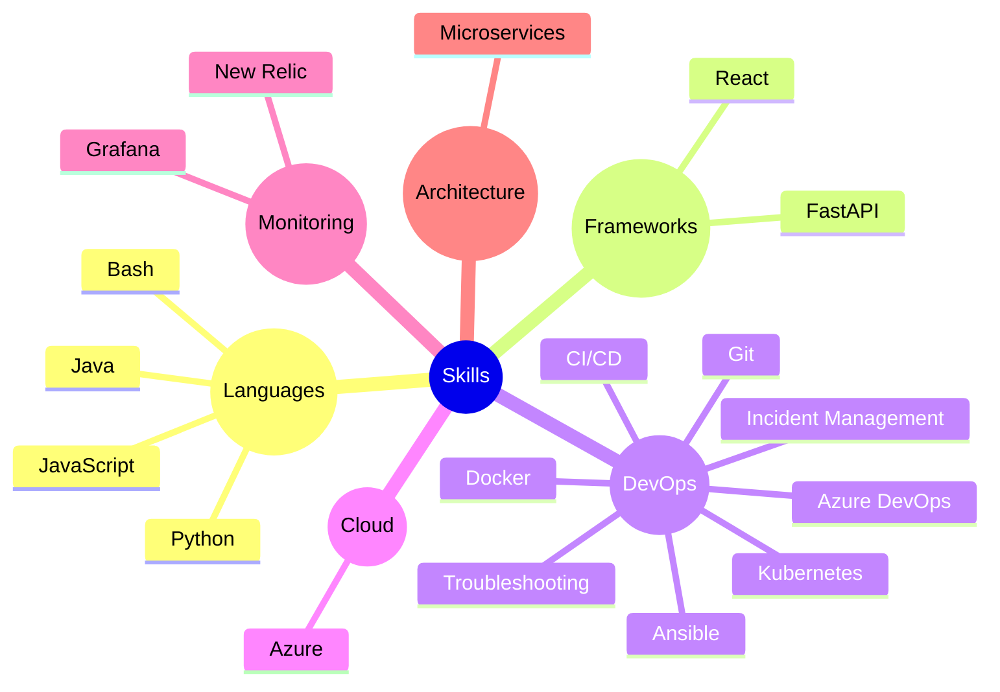

"Seja curioso. Leia bastante. Experimente coisas novas. Acredito que o que muitos chamam de inteligência é, na verdade, apenas curiosidade." — Aaron Swartz

## 🛠️ Technologies and Tools

## GitHub Stats  

  
   
  

  

